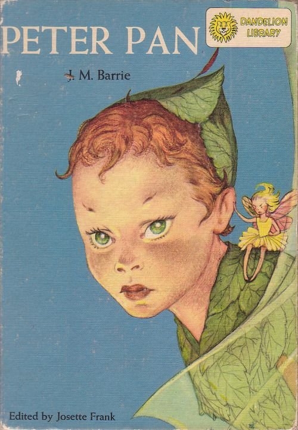

# Peter Pan, or The Boy Who Wouldn't Grow Up

Peter is a boy who lives in neverland with the lost boys.
Together they live a good live and fight against their enemy captain Hook.
One day Peter takes Wendy and her two brothers with him to neverland.
Wendy is supposed to be the mother of the lost boys.
And there is also a ticking crocodile, carrying a clock in his stomach.

## Get to know Peter
* small
* wears a hat
* has a companion fairy called Tinker Bell
* very childish
* likes to play games and change the rules at it suits him

Peter Pan about finding the way to neverland:

> Second star to the right and straight on 'til morning.

